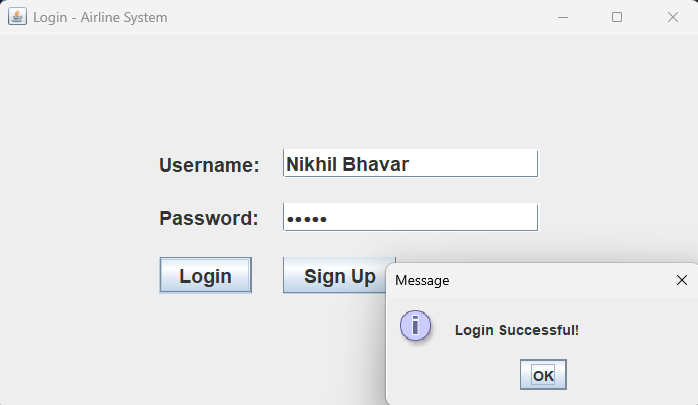
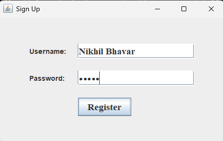
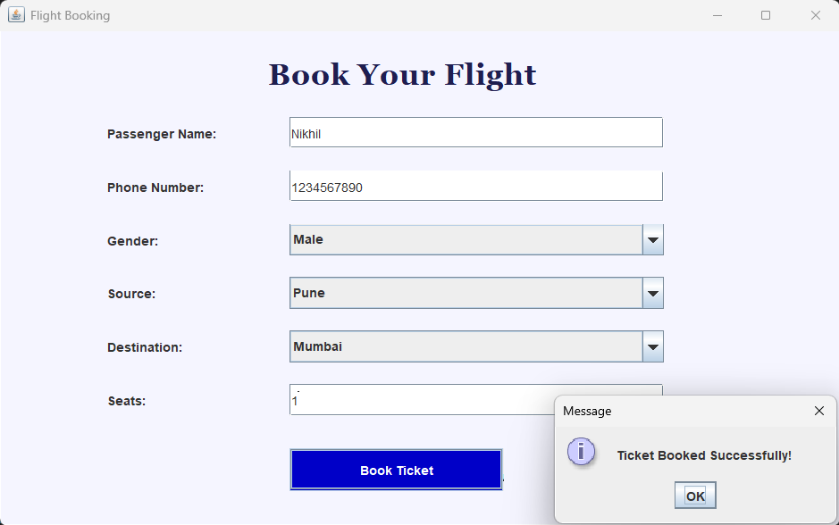
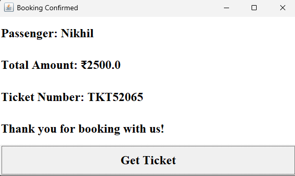

<h1 align="center">✈️ Airline Booking System</h1> 
A Java AWT + MySQL desktop application for airline ticket booking, user authentication, and billing.

## 📌 Overview

The Airline Booking System is a simple desktop-based application built using Java AWT and MySQL.
It demonstrates core concepts of:

• GUI application development 
• JDBC database connectivity 
• User authentication 
• Ticket booking workflows 
• Basic software architecture in Java 

This project is ideal for students and beginners exploring Java-based desktop applications.

## 🧩 Features

• User Authentication 
• Login and registration system 
• Basic form validation 
• Ticket Booking 
• Passenger detail entry 
• Source and destination selection 
• Booking date selection 
• Ticket Summary 
• View generated ticket 
• Passenger + flight details 
• Billing Module 
• Display total fare 
• Simple invoice-like UI 
• MySQL Integration 
• Store user accounts 
• Store booking data 
• JDBC connectivity using MySQL Connector 

## 🛠 Tech Stack

• Programming: Java 
• GUI Framework: AWT 
• Database: MySQL 
• Connectivity: JDBC (MySQL Connector/J) 
• Tools: IntelliJ IDEA / VS Code, Git, MySQL Workbench 

## ⚙️ Setup Instructions

**1️⃣ Configure MySQL Database**

  • Run the following commands:

CREATE DATABASE airline;

USE airline;

CREATE TABLE users (

  id INT AUTO_INCREMENT PRIMARY KEY,
  
  username VARCHAR(50),
  
  password VARCHAR(50)
);

CREATE TABLE bookings (

  id INT AUTO_INCREMENT PRIMARY KEY,

  passenger VARCHAR(100),
  
  source VARCHAR(50),
  
  destination VARCHAR(50),
  
  date VARCHAR(50)
);

  **• Update database credentials in DBConnection.java:**

String url = "jdbc:mysql://localhost:3306/airline";

String username = "root";

String password = "your_password";

**2️⃣ Compile the Project **
  javac -cp ".;lib/mysql-connector-j-9.3.0.jar" src/*.java

**3️⃣ Run the Application **
  java -cp ".;lib/mysql-connector-j-9.3.0.jar;src" Main

## 🖼️ Screenshots

### 🔐 Login Page

  

---

### 📝 Registration Page

  

---

### 🛫 Flight Booking Page

  

---

### 🎫 Ticket Summary

  

## 📌 Future Improvements

• Admin dashboard 
• Flight search + pricing 
• PDF ticket generation 
• Notification system 
• UI modernization
